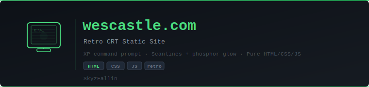

<p align="center">
  
</p>

<p align="center">
  
  
  
  
  
</p>

# wescastle.com

A retro CRT terminal animation built with pure HTML, CSS, and JavaScript. Simulates a Windows XP command prompt on a vintage beige monitor — complete with scanlines, phosphor glow, and typed commands.

**Author:** [SkyzFallin](https://github.com/SkyzFallin)

## Features

- Realistic CRT monitor frame with buttons and branding
- Green phosphor text with scanline overlay and flicker effect
- Auto-typing command sequence that loops
- No dependencies — single `index.html` file

## Usage

Open `index.html` in any browser, or serve it with any static file server:

```bash
# Python
python -m http.server 8000

# Node
npx serve .
```

## License

MIT
