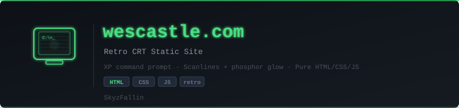

<p align="center">
  
</p>

<p align="center">
  
  
  
  
  
</p>

# wescastle.com

Source for [wescastle.com](https://wescastle.com) — the personal site of
[Wes Hardcastle](https://github.com/SkyzFallin) (offensive security operator,
red-team tooler, developer).

The homepage is an interactive retro CRT terminal — a Windows-style command
prompt on a vintage beige monitor, complete with scanlines, phosphor glow, and
an auto-typed intro. Once the intro finishes (or you skip it), you get a live
prompt: type `help` and poke around. The blog lives at
[/blog/](https://wescastle.com/blog/).

Everything is static, self-hosted, and dependency-free at runtime: no
frameworks, no trackers, no third-party requests (fonts are served from
`/fonts/`).

## Layout

```
index.html              CRT terminal homepage (interactive)
404.html                CRT-styled 404 page
blog/                   Blog index + posts (self-contained HTML)
fonts/                  Self-hosted woff2 fonts + fonts.css
.well-known/security.txt
robots.txt / sitemap.xml / feed.xml (RSS)
og-image.png            Social share card
scripts/build.py        Regenerates sitemap.xml + feed.xml from post metadata
```

## Working on it locally

Serve the repo root with any static file server (needed so absolute paths like
`/fonts/` and `/blog/` resolve):

```bash
# Python
python -m http.server 8000

# Node
npx serve .
```

## Adding a blog post

1. Copy an existing post in `blog/` as a template and edit it. Keep the
   `article:published_time` meta tag accurate — it's the source of truth for
   dates.
2. Add a card for it in `blog/index.html` and a line in the `open /blog`
   section of `index.html`.
3. Regenerate the sitemap and RSS feed:

```bash
python3 scripts/build.py
```

The script also fails loudly if a post is missing required metadata or isn't
linked from the blog index / homepage, and CI runs it in `--check` mode on
every push.

## License

MIT
